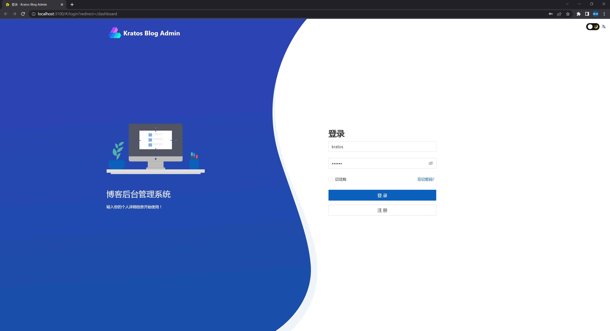
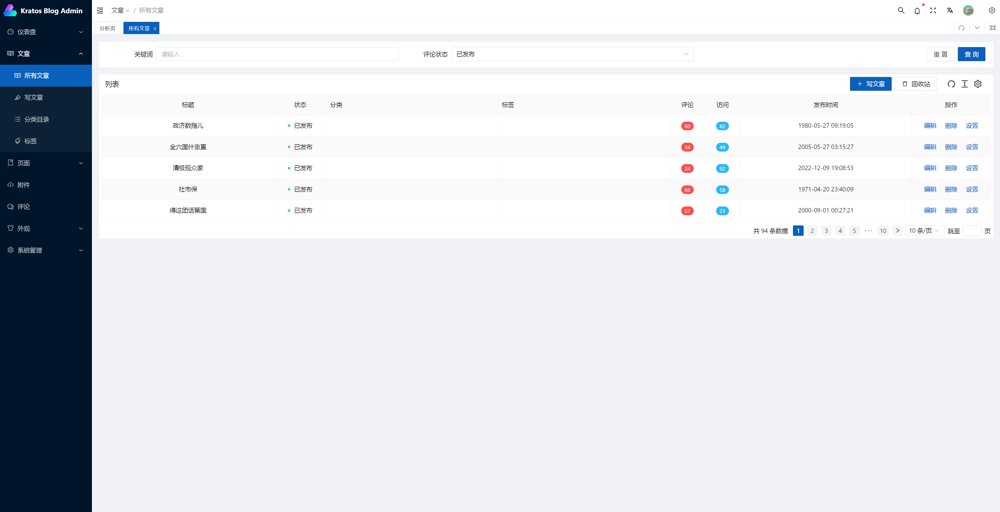
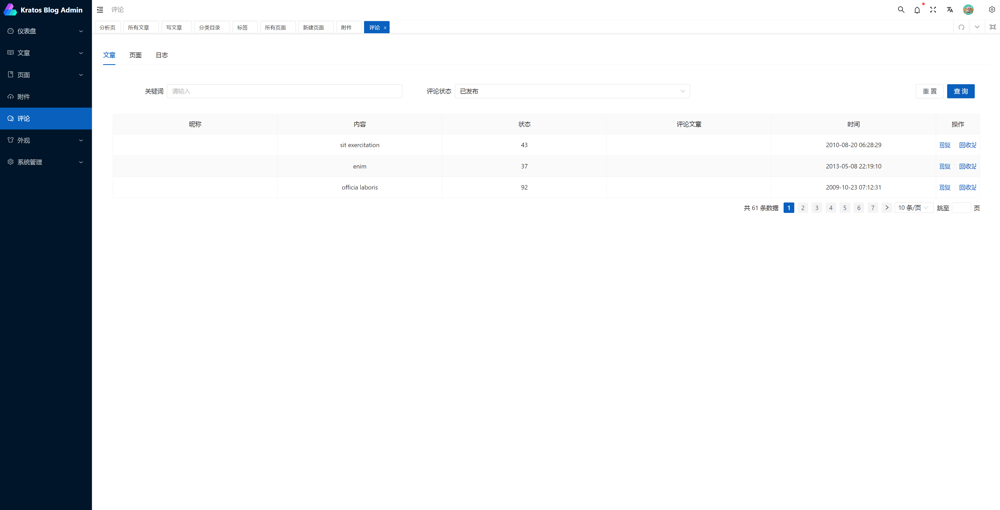

# 克拉托斯波克 Kratos-Blog

一个Golang的博客系统/CMS。

- 后端基于 [golang](https://go.dev/) + [go-kratos](https://go-kratos.dev/)
- 前端基于 [VUE3](https://vuejs.org/) + [TypeScript](https://www.typescriptlang.org/)

## 项目结构

| 子项目名 | 项目路径                                                                                   |
|------|----------------------------------------------------------------------------------------|
| 后端   | [/blog-backend](https://github.com/tx7do/kratos-blog/tree/main/blog-backend)           |
| 管理前端 | [/blog-admin](https://github.com/tx7do/kratos-blog/tree/main/blog-frontend/blog-admin) |
| 展现前端 | [/blog-view](https://github.com/tx7do/kratos-blog/tree/main/blog-frontend/blog-view)   |

## 管理后台截图

- 登陆界面

- 分析页面

- 博文列表

- 写文章

- 评论列表

## 博客基本功能设计要点

### 文章（Post）

博客系统的“文章”，正确的英文表达是post，英文单词里post和article的区别在于，post只是随心所欲写的文章，而article指的是论文那样的经过精心雕琢，旁征博引，并且有可能在学术期刊上发表的文章。

文章需要具备：标题、Slug、创建时间、发布时间、修改时间、摘要和内容等要素，也会包含所属分类、标签、阅读量和点赞量等次要信息。

Slug是博客的特色，它指的是一篇文章的URL。例如：文章：《Try the New Azure .NET
SDK》，它的URL为 <https://edi.wang/post/2019/12/5/try-the-new-azure-net-sdk>，其中**try-the-new-azure-net-sdk**
即为该文章的Slug。Slug讲究的是 **“人类可读”**
，一般情况下均为博客标题对应的英文表达，用中划线分割英文单词，Slug也对博客的SEO起到了关键作用。如果你的博客文章用的是数据库ID、文章标题的HTML
Encoding等做URL，请更换为Slug。特别是遇到中文文章，如果标题被URL
Encoding了，那么对于SEO和链接分享，都是灾难。一个Slug一旦定下，尽量不要改动，虽然大部分博客系统都支持修改Slug，但是对于被搜索引擎收入的文章，改了Slug就会导致404。比较完备的博客系统（如WordPress）支持采用301重定向方式告诉搜索引擎原文地址已变化。

摘要有两个作用，一是用于在列表视图中显示文章信息预览，二是用于SEO，放在description这个meta标签中，可以帮助搜索引擎精准定收入的内容。对于中文内容，需要注意是否输出的HTML源代码被Encoding过，ASP.NET
Core默认的Encoding会对SEO造成灾难（我的博客系统因为面向英语用户，不考虑中文支持，所以并不解决这个问题）。摘要可以自动抓取文章前几百字，也可以像微信公众号那样要求用户手工填写。我的博客采用的是自动取文章前400字。结合SEO的关系，我的文章通常开头段落就是概要，这样可以让用户在搜索引擎预览页面就能看到准确内容，而不是页面上无关紧要的UI元素。

文章的状态通常包括：草稿、发布、回收。用户仅能看到已发布的文章，管理员可在后台更改文章状态。

### 评论（Comment）

评论是博客中作者和读者互动的主要方式。有些博客要求读者登录后才能发表评论，而有些可以允许游客评论。登录的好处在于可以识别你的读者，并有效防止垃广告评论。但要求登录也会给用户造成操作上多了一个步骤，嫌麻烦的用户就不会进行评论。

### 分类（Category）

像建文件夹一样将文章根据内容进行区分，即为分类。文章分类后，可以帮助读者快速检索同种类的文章。分类的另一个功能就是产生 OPML
及 RSS/Atom 订阅源。

分类需要一个标题、一个简介，以及一个路由名称。

### 标签（Tag）

一篇文章所提到的话题，即为文章的标签。和分类一样，标签也是多对多关系。标签可以作为检索文章的依据，类似关键词，快速查找相关内容的文章。

标签云（Tag Cloud）是博客中用来列出最热门标签的功能。通常使用跟大号字、更明显的颜色来标识出对应文章较多的标签。标签云可以作为博客博主的个性化属性，一眼就能看出博主热衷于什么话题。

### 归档（Archive）

以时间（年、月、日）整理的博客文章即为归档，它和分类的区别在于归档只以时间为标准来划分文章。Archive的SEO相对于文章、分类、标签来说，并不那么关键。所以除了URL可以按年月划分以外，并没有额外的讲究。

### 页面（Page）

页面是博客的可选功能之一，事实上，它更接近于CMS的功能。有些内容并不适合以文章的形式发布，比如“关于”页面。这样的页面通常与发布时候的时间无关，内容也经常更新，排版设计也非常自由，不单纯是文字。

页面通常不需要评论、标签和分类等属性，但可以有发布和编辑时间。和文章一样，页面也需要注意Slug。

### 订阅（Subscription）

读者订阅博客的主要方式有Feed（RSS/ATOM）及Newsletter。Feed方式本质上是被动订阅，需要客户端软件发起请求给服务器，检查是否有新文章发表，才能显示到客户端里。Newsletter一般采用Email形式主动发送给订阅用户，但这要求博客系统的编写者实现Email订阅功能，也要求管理员维护Email服务。订阅一般只推送近期发表的新文章，例如前10、20篇，而不会每次都推送全部文章导致客户端爆炸。

订阅一般可按文章分类提供，以便于只对某些分类感兴趣的读者阅读。有些博客系统也提供文章评论的订阅源，以便读者观摩吐槽大会。

### 版本控制（Version Control）

更接近CMS的博客系统通常提供版本控制功能，允许用户回滚文章或页面的历史版本。设计版本控制的时候，不能只考虑往前回滚，得还能再滚得回来。通常，用户每次编辑一篇已经写好的文章，就会产生一个新版本，类似于git对于一个文件的commit。博客的版本控制也类似于代码版本控制，你可以选择保存一篇文章的完整内容作为历史版本，也可以选择每次只保存变化量信息（delta）。保存完整内容不容易后续花费大量时间精力
，但是会占用较多存储空间。保存内容变化量节省数据库空间，但实现代码容易占用大量精力。

### 主题及个性化（Theme）

好用的博客系统通常支持主题，毕竟个性化是博客本身应有的特点之一。WordPress积累了大量的主题库，也允许自制主题。

### 用户及权限（User & Permission）

博客系统分为个人、团队及博客平台。个人博客系统一般为：单用户，不需要设计权限、注册等功能；多用户博客，则需要实现不同的角色和权限，比如博客管理员、审核专员、撰稿人、评论管理员等等。

### 插件（Plugin）

插件功能可以在不更改博客代码的情况下，按需拓展博客的功能。

### 图片及附件的处理（Attachment）

图片一般有3个地方存放：文件系统、数据库、云上OSS存储服务。

### 敏感过滤及评论审查

### 静态化（Staticize）

静态化技术，即将服务端渲染完的页面保存为真正的HTML文件于磁盘上，Web服务器只需要传输静态文件，而不需要做其他工作，比如访问数据、脚本语言解析执行等，因此效率非常高，也极大减小了服务器的压力。

### 通知系统（Notification）

博客通可以通过Email、IM机器人，甚至语音的形式给管理员或用户发送通知。

## 参考资料

* [博客系统知多少：揭秘那些不为人知的学问（一）](https://mp.weixin.qq.com/s?__biz=MzU0MTA2MTkwMQ==&mid=2247484915&idx=1&sn=b38ce4fc93cfce88a2f536db93862b77&chksm=fb2ee391cc596a87176bbfa206fb3b90db0f5af7ac752a1f1eb5aad8df6ed477baa92a4b6250&scene=21#wechat_redirect)
* [Halo博客系统](https://halo.run/)
